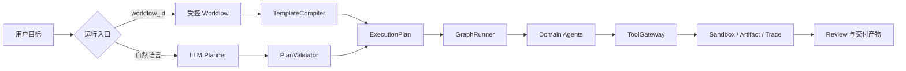

# ProjectOS

ProjectOS 是一个面向软件交付的半托管多 Agent 编排平台。它把需求、架构、任务拆分、代码分区、测试和审查组织成可追踪的 WorkItem DAG，并通过 Policy、Artifact、Sandbox 和 Trace 把模型输出限制在受控边界内。

## 核心链路

```text
Requirement -> Architecture -> Task -> Bootstrap -> Code -> Test -> Review
                         -> Planner -> GraphRunner -> Trace / Artifact / Memory
```

当前实现包含：

- 结构化 `ExecutionPlan`、WorkItem 依赖和有界并发调度。
- 统一 Agent/Tool/Workflow 注册与执行边界，TaskAgent、CodeAgent 使用标准执行模式。
- Artifact staged/candidate/promotion 流程，以及代码分区的 Git worktree/ChangeSet 合并。
- Docker SandboxEvidence、失败归因、有限重试和 Repair Plan。
- 环境配置节点声明 runtime 并准备可复现依赖；交付完成后，控制平面可自动识别受支持的应用、启动数据库和应用容器。
- Trace 级 Memory：分层事件、FTS5/可选向量召回、预算化上下文、durable 审批。
- 版本化 checkpoint 和受校验的 `/resume` 断点恢复。
- FastAPI 控制面：项目创建、受控 Workflow 启动、Trace/Memory 查询和恢复。

## 快速开始

```bash
python3 -m venv .venv
.venv/bin/pip install -e .
.venv/bin/python -m unittest discover -s tests -p 'test_*.py'
```

启动 API：

```bash
.venv/bin/uvicorn app.api.asgi:app --reload
```

默认 API 地址为 `http://127.0.0.1:8000`，可以从 `/docs` 查看 OpenAPI 控制面。

## 提交一次真实交付

创建项目并提交一次真实交付。首次执行测试时，环境配置节点会让控制平面自动拉取白名单镜像；用户无需手动配置 Docker：

```bash
curl -X POST http://127.0.0.1:8000/api/v1/projects \\
  -H 'content-type: application/json' -d '{"name":"todo_demo"}'
# 可选：指定本地项目目录；不传 path 时默认使用 projects/todo_demo
curl -X POST http://127.0.0.1:8000/api/v1/projects \\
  -H 'content-type: application/json' \\
  -d '{"name":"todo_local","path":"/tmp/projectos/todo_local"}'
# 导入已由 ProjectOS 生成、但尚未登记的本地目录；不会改写项目文件
curl -X POST http://127.0.0.1:8000/api/v1/projects/import \\
  -H 'content-type: application/json' \\
  -d '{"name":"existing_demo","path":"/tmp/projectos/existing_demo"}'
curl http://127.0.0.1:8000/api/v1/projects/todo_demo/runtime/preflight
# 测试运行会自动准备受信镜像；第三方 requirements 仍需显式批准
curl http://127.0.0.1:8000/api/v1/projects/todo_demo/runtime/status
# 如果 BootstrapAgent 声明了 requirements.in，需要先批准依赖解析
curl http://127.0.0.1:8000/api/v1/projects/todo_demo/runtime/dependency-approvals
curl -X POST http://127.0.0.1:8000/api/v1/projects/todo_demo/runtime/dependency-approvals/approve
```

交付完成后直接启动生成项目。控制平面会根据 `workspace` 和 `requirements.in` 自动识别受支持的应用，复用依赖缓存、启动 PostgreSQL，并按项目声明的依赖启动 API；FastAPI 前端会从同一后端服务挂载：

```bash
curl -X POST http://127.0.0.1:8000/api/v1/projects/todo_demo/runtime/runs
```

返回的 `services[].url` 即可访问地址。端口由控制平面从 `8100-8299` 池动态分配，`8000` 保留给 ProjectOS 控制面；运行状态和停止接口如下：

```bash
curl http://127.0.0.1:8000/api/v1/projects/todo_demo/runtime/runs/<run_id>
curl -X DELETE http://127.0.0.1:8000/api/v1/projects/todo_demo/runtime/runs/<run_id>
```

每个新建或导入的项目根目录都会自动生成独立启动脚本。默认的 `start.sh`、`start.ps1` 不依赖
ProjectOS API，会直接使用由受信 `ApplicationCatalog` 生成的 `docker-compose.yml` 启动项目；macOS
用户可以双击 `start.command`：

```bash
./start.sh
# macOS Finder：双击 start.command
# Windows PowerShell
./start.ps1
```

需要让 ProjectOS 接管运行记录时，显式执行 `./start-managed.sh`（或 Windows 的
`start-managed.ps1`）。独立启动的状态写入 `.projectos/runtime/local-run.json`，控制面启动后可通过
`GET /api/v1/projects/<project_id>/runtime/local-status` 或 `GET /api/v1/projects/<project_id>/runtime/status`
读取并探测容器状态。端口可用 `PROJECTOS_BACKEND_PORT`、`PROJECTOS_FRONTEND_PORT`、
`PROJECTOS_WEB_PORT` 覆盖，项目之间通过 Compose project name 和命名 volume 隔离。

动态 Planner 入口不需要选择 Workflow：

```bash
curl -X POST http://127.0.0.1:8000/api/v1/projects/todo_demo/conversations
curl -X POST http://127.0.0.1:8000/api/v1/projects/todo_demo/conversations/<conversation_id>/messages \\
  -H 'content-type: application/json' \\
  -d '{"content":"实现一个支持创建、列表、完成和删除的 Todo 应用，并完成测试和交付审查"}'
```

如果测试 Agent 请求真实动态能力，先查看候选，再批准并恢复：

```bash
curl http://127.0.0.1:8000/api/v1/projects/todo_demo/runs/<trace_id>/capabilities
curl -X POST http://127.0.0.1:8000/api/v1/projects/todo_demo/runs/<trace_id>/capabilities/approve \\
  -H 'content-type: application/json' -d '{"source_name":"mcp"}'
```

也可以直接运行 CLI；不传 `--workflow` 就是动态 Planner，传入受控 Workflow 才是固定 DAG：

```bash
.venv/bin/python main.py --project ./projects/todo_cli \\
  --goal '实现 Todo MVP 并完成测试和交付审查'
```

运行结果和证据位于项目的 `.projectos/runs/<trace_id>/`，最终产物包括
`requirement.md`、`architecture.md`、`tasks.md`、`environment.md`、`implementation.md`、
`tests.md` 和 `review.md`。现有示例产物见 `projects/Mega_Shit/` 与
`projects/todo_architecture_compact_demo/`；后者是架构/实现阶段样例，不代表完整交付已通过。

## 运行架构图



## 重要边界

Memory 只提供运行连续性和受控召回，不替代 Policy、Artifact 或 Trace 的权威事实。Agent 不能自行批准外部工具、依赖、durable Memory 或正式产物发布。恢复流程会重新校验计划、Trace 和 checkpoint，失败或半完成节点不会被当作已完成节点跳过。

## 文档

- [文档索引](docs/README.md)
- [总体架构](docs/ARCHITECTURE.md)
- [MVP 完成度](docs/roadmap/mvp-status.md)
- [一次请求的实际运行链路](docs/architecture/request-trace.md)
- [Orchestration API](docs/api/orchestration-api.md)
- [Memory API](docs/api/memory-api.md)
- [演示产物与证据索引](docs/demo-evidence.md)

## 当前限制

这是一个可演示的 MVP 基础架构：后台执行器仍是进程内线程池，尚未提供认证、外部队列租约、真实 MCP connector 和完整的测试 worktree 隔离。生产化前还需要补齐这些运行时能力及更严格的质量评估。
